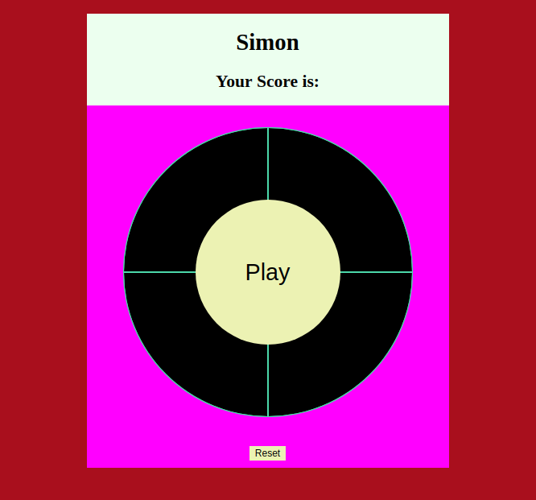

# GA Project1 Simon
This is a web page for playing the Simon memory game.



[hosted here](https://sirairdude.github.io/ga-project1-simon/)

## Current Features

- Users can start and play the game
- Users can prematurely end the game with the reset button

### Technologies Used

- HTML
- CSS
- Javascript

### Installing

1. Fork and clone the [project repository](https://github.com/SirAirdude/ga-project1-simon)

2. Change dircetory into the project.

3. Start the server
```
http-server
```

4. Open a web browser and enter `localhost: ****` into the address bar of the browser. (replace `****` with the port number provided when you start the server)

## Contributions

- Main Repository - https://github.com/SirAirdude/ga-project1-simon
- please submit issues [here](https://github.com/SirAirdude/ga-project1-simon/issues)

## Authors

* **Kyle Clabough** - creator https://github.com/SirAirdude

## Other Links 

Trello - https://trello.com/b/F3GaUNiG/ga-project-1-simon